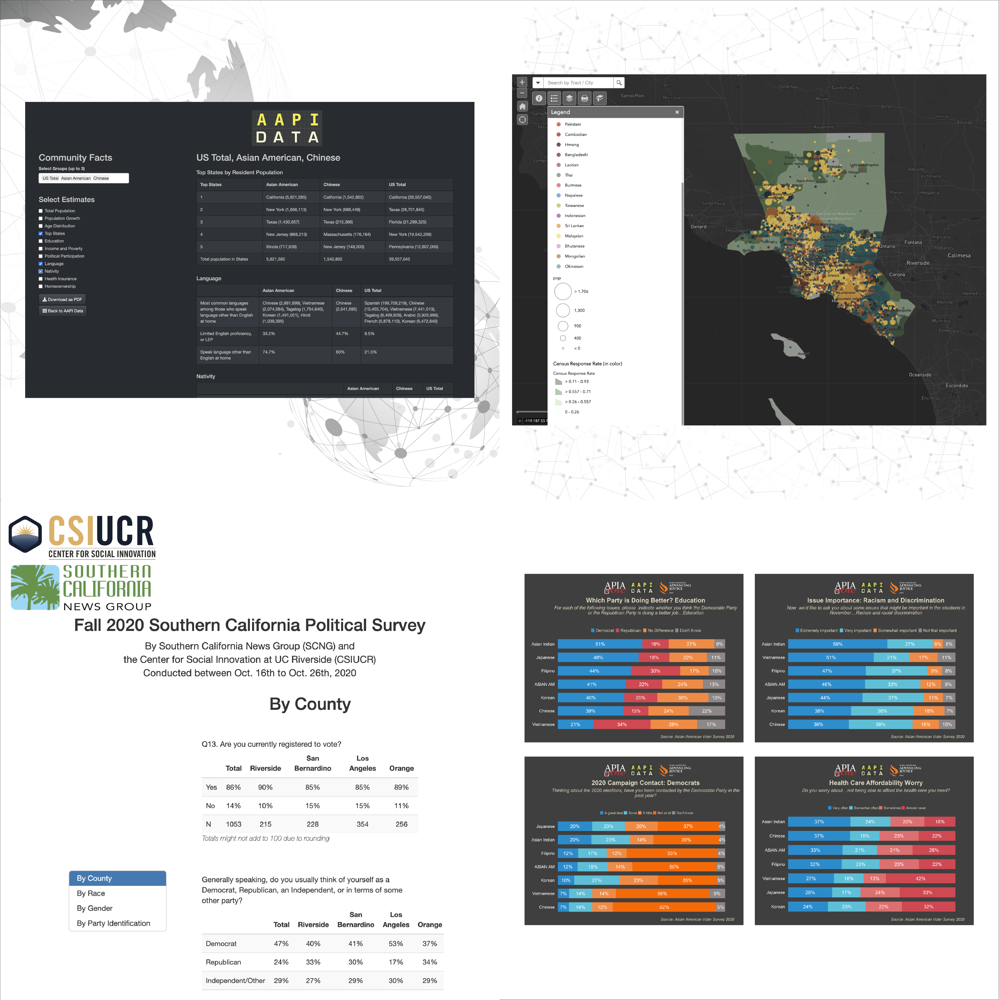

```{r, include=FALSE}
knitr::opts_chunk$set(
  results='asis', 
  echo = FALSE
)

library(magrittr) # For the pipe
source("cv_printing_functions.r")

# Read in all data and initialize a CV printer object
# CV <- create_CV_object(
#   data_location = "https://docs.google.com/spreadsheets/d/14MQICF2F8-vf8CKPF1m4lyGKO6_thG-4aSwat1e2TWc",  
#   pdf_mode = params$pdf_mode,
#   cache_data = params$cache_data
# )

CV <- readr::read_rds('cached_positions.rds')
```


```{r}
# When in pdf export mode the little dots are unaligned, so fix that with some conditional CSS.
if(params$pdf_mode) {
    cat("
<style>
:root{
  --decorator-outer-offset-left: -6.5px;
}
</style>")
}
```


Aside
================================================================================

```{r}
# Build interactive network of positions colored by section
# and connected if they occurred in the same year
# datadrivencv::build_network_logo(CV$entries_data)

#insert the map of LA from the census project
#

```


```{r}
if(params$pdf_mode){
  cat(" ")
} else {
  cat("[<i class='fas fa-download'></i> Download a PDF of this CV](https://sunnyyshao.github.io/cv/sunnyshao_cv.pdf)")
}
```

Contact {#contact}
--------------------------------------------------------------------------------

```{r}
CV %>% print_contact_info()
```


Research Skills {#skills}
--------------------------------------------------------------------------------

```{r}
CV %>% print_skill_bars()
```

Disclaimer {#disclaimer}
--------------------------------------------------------------------------------

Made with the R package [**pagedown**](https://github.com/rstudio/pagedown). 


Main
================================================================================

Sunny Shao {#title}
--------------------------------------------------------------------------------

```{r}
# Note the special double pipe so we modify the CV object in place
CV %<>% print_text_block("intro") 
```

Education {data-icon=graduation-cap data-concise=true}
--------------------------------------------------------------------------------

```{r}
CV %<>% print_section('education')
```

Research Experience {data-icon=suitcase}
--------------------------------------------------------------------------------

```{r}
CV %<>% print_section('data_consulting_positions')
```

Survey Projects & Focus Group Study {data-icon=poll}
--------------------------------------------------------------------------------

```{r}
CV %<>% print_section('survey_projects')
```

Data Tools Development {data-icon=database}
--------------------------------------------------------------------------------

```{r}
CV %<>% print_section('data_tools')
```

Research Reports  {data-icon=book}
--------------------------------------------------------------------------------

```{r}
CV %<>% print_section('publication_reports')
```

::: aside
```{r}
#CV %<>% print_text_block("industy_experience_aside")
```
:::

Blogpost Writting {data-icon=pen}
--------------------------------------------------------------------------------
```{r}
CV %<>% print_section('blog')
```

Teaching & Workshop Experience {data-icon=chalkboard-teacher}
--------------------------------------------------------------------------------

```{r}
CV %<>% print_section('workshop')
CV %<>% print_section('teaching_positions')

```

Selected Presentations & Invited Talks {data-icon=users}
--------------------------------------------------------------------------------
```{r}
CV %<>% print_section('presentation')
```

```{r}
CV %<>% print_section('invited_talk')
```

Selected Press  {data-icon=newspaper}
--------------------------------------------------------------------------------

```{r}
CV %<>% print_section('press')
```

Grants and Awards {data-icon=award}
--------------------------------------------------------------------------------

```{r}
CV %<>% print_section('grant')
```

```{r}
CV %<>% print_links()
```

